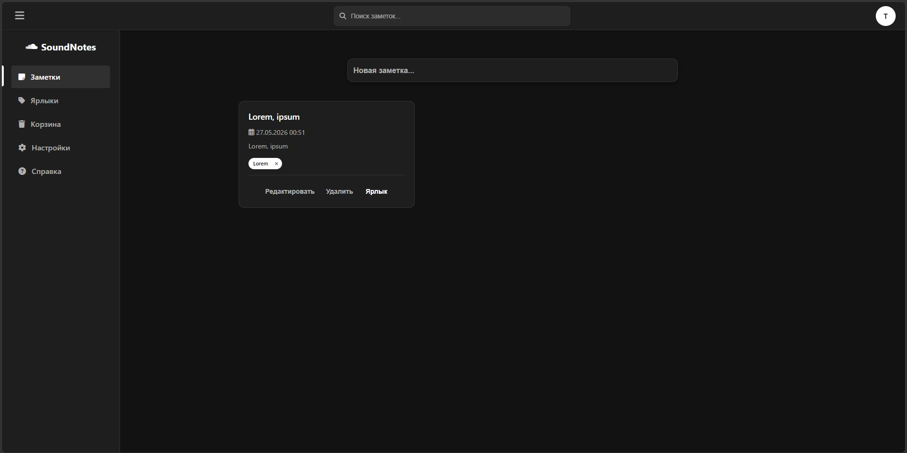
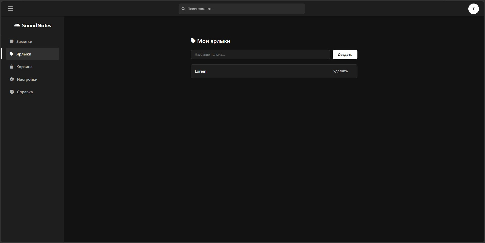
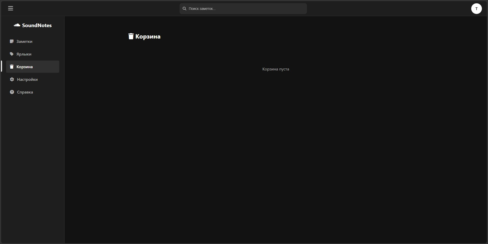
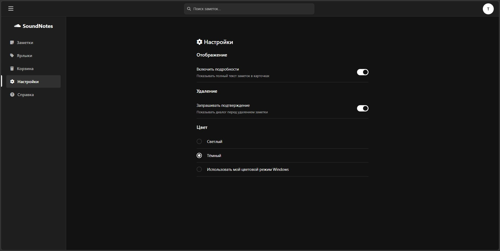
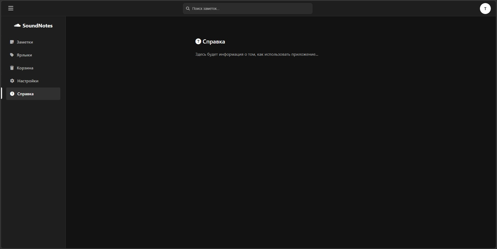

# SoundNotes – Облачное приложение для заметок

Веб-приложение для создания, редактирования и организации заметок с поддержкой ярлыков, корзины, пользовательских аватаров и поиска. Данные хранятся на сервере (PHP + MySQL).

## Возможности

- Регистрация и вход с хэшированием паролей
- Заметки: создание, редактирование, мягкое удаление (корзина), восстановление, полное удаление
- Форматирование текста (жирный, курсив, заголовки, выравнивание)
- Ярлыки для группировки заметок
- Корзина с возможностью восстановления или окончательного удаления
- Поиск по заголовку, тексту и хэштегам (например, `#работа`)
- Профиль пользователя: аватар (загрузка изображения)
- Настройки: светлая/тёмная/системная тема, отображение полного текста в карточках, подтверждение удаления
- Адаптивный дизайн

## Технологии

- **Фронтенд:** HTML5, CSS3 (Flex/Grid), JavaScript (ES6+), Font Awesome 6
- **Бэкенд:** PHP 7.4+, MySQL
- **Сервер:** Apache

### 1. Домен

[c98982n6.beget.tech](c98982n6.beget.tech) (Безопасно, клянусь!)

### 2. Файлы проекта

```
/
├── index.html
├── auth.html
├── html_main.html
├── styles.css
├── auth.js
├── main.js
├── api/
│   ├── db.php
│   ├── auth_check.php
│   ├── register.php
│   ├── login.php
│   ├── logout.php
│   ├── notes.php
│   ├── trash.php
│   ├── labels.php
│   └── avatar.php  
└── README.md
```

### 3. Скриншоты интерфейсов приложения

**Заметки**



**Ярлыки**



**Корзина**



**Настройки**



**Справка**



### 4. Авторы

Верещак Д. - [https://github.com/Oblivion-SC](https://github.com/Oblivion-SC)  

Василюк Ф. - [https://github.com/FelixV-sigma](https://github.com/FelixV-sigma)

Буйдин Н. - [https://github.com/potsosformu](https://github.com/potsosformu)
